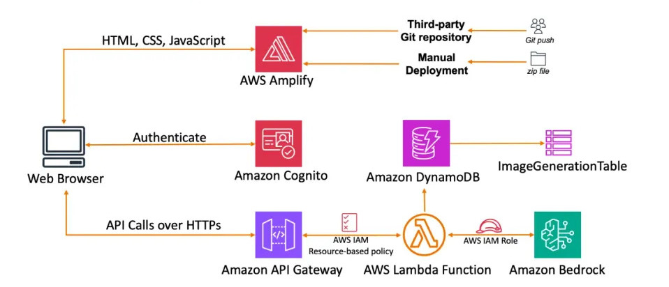

# AWS AI-Powered Image Editing Web Application

A serverless web application that leverages AWS Bedrock's Titan Image Generator V2 for AI-powered image inpainting and outpainting capabilities. Built with AWS Amplify, Lambda, API Gateway, and Cognito for a fully managed, scalable solution.

## Features

- **AI-Powered Image Editing**: Inpainting and outpainting using Amazon Titan Image Generator V2
- **Multiple Editing Modes**:
  - Inpainting: Fill in masked areas of images
  - Outpainting: Extend images beyond their original boundaries
  - Precise Outpainting: High-precision image extension
- **Serverless Architecture**: Fully managed AWS services for scalability and reliability
- **User Authentication**: Secure access with AWS Cognito
- **Usage Tracking**: DynamoDB logging for monitoring and analytics
- **CORS-Enabled API**: Ready for cross-origin requests

## Architecture

The application uses a serverless architecture built on AWS:

- **Frontend**: Static web app hosted on AWS Amplify
- **Authentication**: AWS Cognito for user management
- **API**: AWS API Gateway for RESTful endpoints
- **Compute**: AWS Lambda for serverless image processing
- **AI/ML**: AWS Bedrock with Titan Image Generator V2
- **Database**: DynamoDB for usage logging and analytics

## Prerequisites

- AWS Account with access to:
  - AWS Bedrock (Titan Image Generator V2 model enabled)
  - AWS Lambda
  - AWS API Gateway
  - AWS Cognito
  - AWS DynamoDB
  - AWS Amplify
- Node.js and npm (for local development)
- AWS CLI configured with appropriate credentials
